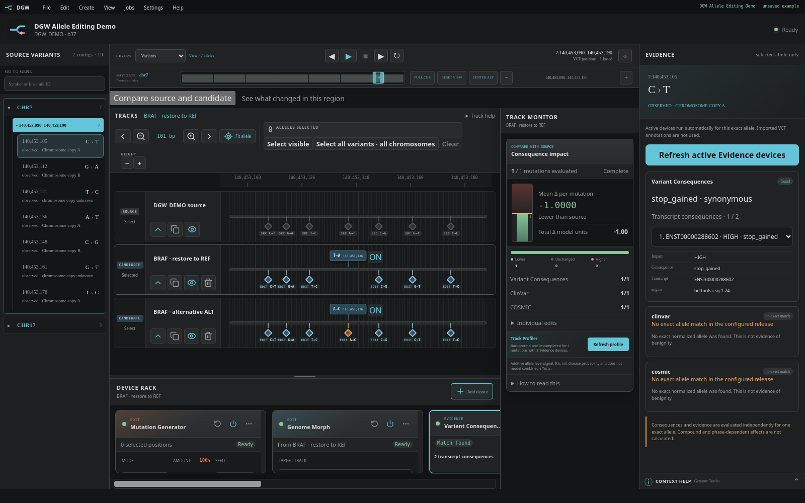

<p align="center"></p>

# Digital Genome Workstation

Digital Genome Workstation (DGW) is a desktop application for editing genome variants and exploring their predicted consequences without changing the original VCF.

Inspired by the mature digital audio workstation ecosystem, DGW lets you duplicate a genome into experimental tracks, apply reversible edits through devices, and compare the results. The aim is a practical genome editor, not a genome browser with a musical appearance.



## What you can do

- Load a VCF, select a sample, and navigate by chromosome, region or gene.
- Edit individual alleles or run bulk operations with Mutation Generator, Genome Optimizer and Genome Morph.
- Inspect predicted consequences and exact database matches, then compare tracks using the Track Monitor and Variant Map.
- Save and reopen projects, export VCFs or regional FASTA, and use the same core operations through an MCP client.

Current resource profiles support human GRCh37 (b37/hs37d5) and GRCh38 (hg38). VCF annotations are not required: DGW normalizes a private copy of the selected sample and evaluates alleles using separately installed resources.

DGW is research software, not a diagnostic tool. Its scores describe independently evaluated alleles, not disease risk or the combined biological effects of several edits.

## Get started

DGW currently runs from source. Install Rust 1.86+, Node.js 20+ and the platform prerequisites described in the [Quick Start](docs-site/docs/usage/quickstart.md), then run:

```bash
npm install
npm run tauri dev
```

Install the matching genome data and platform tools through **Settings → Resources**; packages are maintained in [dgw-data](https://github.com/mrueda/dgw-data). See the [resource setup instructions](docs-site/docs/usage/quickstart.md#3-configure-genome-resources) for details.

Choose **Open an example** on the landing page to explore a prepared project before importing your own VCF.

## Documentation

The [documentation](docs-site/docs/overview.md) covers the workflow and implementation:

- [Input VCF requirements](docs-site/docs/usage/input-vcf.md)
- [Editing and comparing tracks](docs-site/docs/usage/edit-and-compare.md)
- [Evidence and scoring](docs-site/docs/technical-details/scoring-methods.md)
- [Architecture](docs-site/docs/technical-details/architecture.md) and [MCP access](docs-site/docs/technical-details/mcp-server.md)
- [Development](docs-site/docs/technical-details/developer-guide.md), [testing](docs-site/docs/technical-details/testing.md) and [contributing](CONTRIBUTING.md)

## Author and license

Created and maintained by [Manuel Rueda](https://github.com/mrueda). Citation metadata is in [CITATION.cff](CITATION.cff).

Copyright © 2026 Manuel Rueda. Licensed under [Apache 2.0](LICENSE). External tools and biological resources retain their own licenses.
