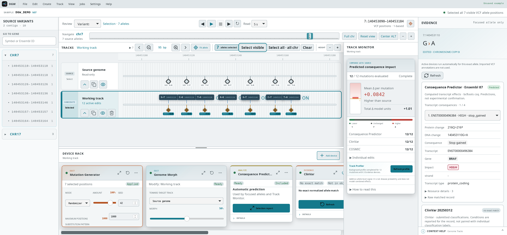

<h1 align="center">Digital Genome Workstation</h1>

Interactive, non-destructive genome variant editing.

  
  
  
  
  

  <a href="https://mrueda.github.io/digital-genome-workstation/">📚 Documentation</a> ·
  <a href="https://github.com/mrueda/digital-genome-workstation/releases">📦 Downloads</a> ·
  <a href="https://www.youtube.com/playlist?list=PLERpT5T_KiqY">🎬 Videos</a> ·
  <a href="https://mrueda.github.io/digital-genome-workstation/docs/usage/quickstart">🧬 Try an example</a> ·
  <a href="LICENSE">⚖️ Apache-2.0</a>

Digital Genome Workstation (DGW) is a desktop application inspired by digital audio workstations: keep the original genome, try edits on separate tracks, and compare their predicted consequences. Devices let you randomize alleles, minimize or maximize a defined impact score, and morph between tracks without changing the source VCF.

  

## 🚀 Get started

Follow the [installation guide](https://mrueda.github.io/digital-genome-workstation/docs/usage/installation) for **Linux, macOS or Windows**. Install GRCh37 or GRCh38 resources from the app, then choose **Open an example** or load your own VCF. Input annotations are not required.

See the [device guide](https://mrueda.github.io/digital-genome-workstation/docs/usage/device-guide) and [paper examples](https://mrueda.github.io/digital-genome-workstation/docs/usage/paper-examples). For source builds and automation, see [Developers](https://mrueda.github.io/digital-genome-workstation/docs/technical-details/) and [MCP](https://mrueda.github.io/digital-genome-workstation/docs/technical-details/mcp-server).

DGW is research software, not a diagnostic tool. Scores evaluate alleles independently; they do not measure disease risk or combined biological effects.

## 👤 Author and license

Created and maintained by [Manuel Rueda](https://github.com/mrueda) as an independent project, developed in his personal time. See [CITATION.cff](CITATION.cff) and [contributing](CONTRIBUTING.md).

Copyright © 2026 Manuel Rueda. Licensed under [Apache 2.0](LICENSE). External tools and biological resources retain their own licenses.
